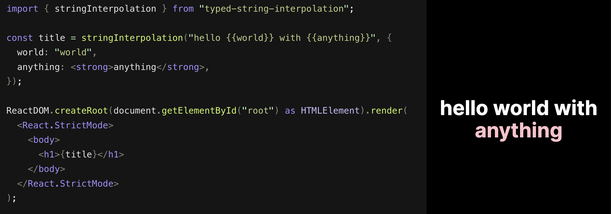

# `typed-string-interpolation`

[String interpolation](https://en.wikipedia.org/wiki/String_interpolation) utility that returns the correct `TypeScript` type based on passed in variables.



> Library used within a React app. Note that the library itself is framework agnostic and could be used in any TypeScript/JavaScript app.

## Main features

- Replaces variables within a string with passed in variables
- Sanity checks that correct variables were passed in
- Returns the correct type based on passed in variable substitutions
- Options to customize return, pattern matching and sanity checking
- Both ES Module and CommonJS distributions available. Use anywhere!
- Tiny footprint:
  - ES Module: `379B` (`533B` unpacked)
  - CommonJS: `612B` (`1.03kB` unpacked)

## Motivation

String interpolation/variable substitution (i.e. injecting variables within text) is a really common operation when building single and multilingual applications alike. Existing string interpolation utilities within the most used `i18n` / `l10n` packages like `i18next` and `formatjs` come with massive overhead while lacking proper TypeScript infer support for the interpolation operation.

This utility aims to provide a high quality string interpolation "primitive" to use as is or within other localization frameworks and tooling.

## Getting started

Easiest way to get started is to play around with a [React example sandbox](https://codesandbox.io/p/sandbox/typed-string-interpolation-react-example-slpjgp?file=%2Fsrc%2Fmain.tsx).

### Install

```bash
npm i typed-string-interpolation
```

### Usage

```ts
// ES module
import { stringInterpolation } from "typed-string-interpolation"
// CommonJS
const { stringInterpolation } = require("typed-string-interpolation")
```

Returns a `string` when the result can be joined into a string.

```ts
stringInterpolation("You have {{n}} messages", {
  n: 3,
}) // "You have 3 messages"
```

Returns an array when the result can't be joined into a `string`. This makes it really easy to use the utility with libraries like `react` or anything else.

```tsx
stringInterpolation("You have {{n}} messages", {
  n: <strong>3</strong>,
}) // ["You have ", <strong>3</strong>, " messages"]
```

## TypeScript support

If the string can be joined you'll get back a `string` type. Otherwise a `union` type within an array is returned based on the passed in variables.

```ts
stringInterpolation("You have {{n}} messages from {{person}}", {
  n: 3,
  person: "John",
}) // : string
```

```tsx
stringInterpolation("You have {{n}} messages from {{person}}", {
  n: <strong>3</strong>,
  person: "John",
}) // : (JSX.Element | string)[]
```

## Options

Takes in an optional third parameter for options:

```js
stringInterpolation(str, variables, options)
```

```ts
type Options = {
  raw?: boolean // default: false
  pattern?: RegExp // default: new RegExp(/\{{([^{]+)}}/g)
  sanity?: boolean // default: true
}
```

`raw`

Return the raw interpolation results without joining to string when you want full control for some reason.

```tsx
stringInterpolation(
  "You have {{n}} messages from {{person}}",
  {
    n: 3,
    person: "John",
  },
  { raw: true }
) // : (number | string)[]
```

`pattern`

Provide your own `RegExp` pattern for variable matching. Must be defined as:

```ts
pattern: new RegExp(/\{{([^{]+)}}/g)
```

`sanity`

If you want to live dangerously, sanity checking can be turned off.

```ts
{
  sanity: false
}
```

Turning of sanity checking removes `throw` from:

- empty string
- string variables and passed in variables count mismatch
- missing variables

## Contributing

Easiest way to contribute is to open new issues for API suggestions and bugs.

### Contributing for a release

Steps for contributing through a pull request:

- Fork `main` on Github and clone fork locally
- Install dependencies
  - `npm ci`
- Make changes while running tests in watch mode
  - `npm run test:unit:all:watch`
  - This project has a `.vscode/launch.json` file containing configuration for running Jest tests with the VSCode debugger which makes it simple to step through logic excecution. Steps to use VSCode debugger:
    - Add a breakpoint to the source code
    - Open a Jest unit test file (`*.test.ts`)
    - Go to the VSCode debugger Tab (`shift` + `command` + `D` on MacOS) and select "Jest Current File" or optionally start the debug session from the command line (`shift` + `command` + `P` on MacOS) and type "Debug: Start debugging"
    - VSCode should open a new terminal window and attach the Jest instance to the debugger
    - Debugger should stop on the defined breakpoint in the source code
- Once all changes are complete, create a new release with [changesets](https://github.com/changesets/changesets)
  - `npm run create-release`
- Commit and push changes to fork
- Open a pull request against the fork
- If the PR needs changes before a merge to `main` can be made, push more changes to the fork until the PR is approved
